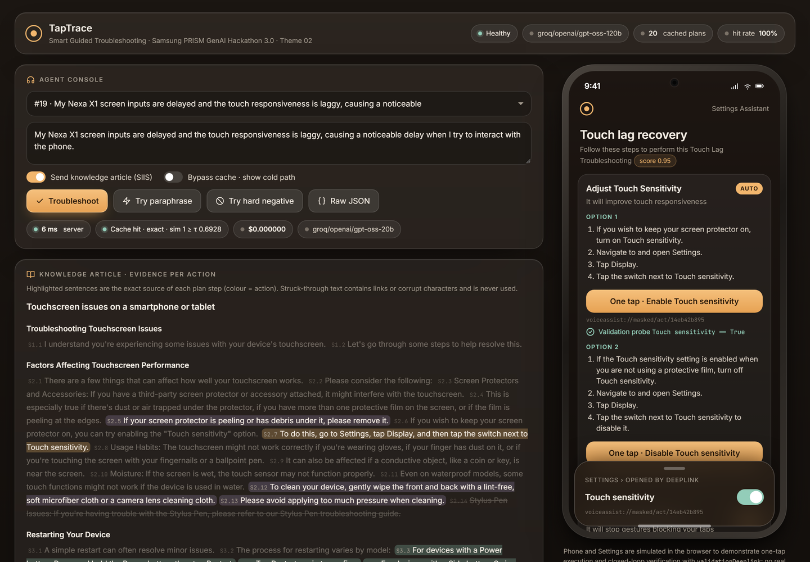
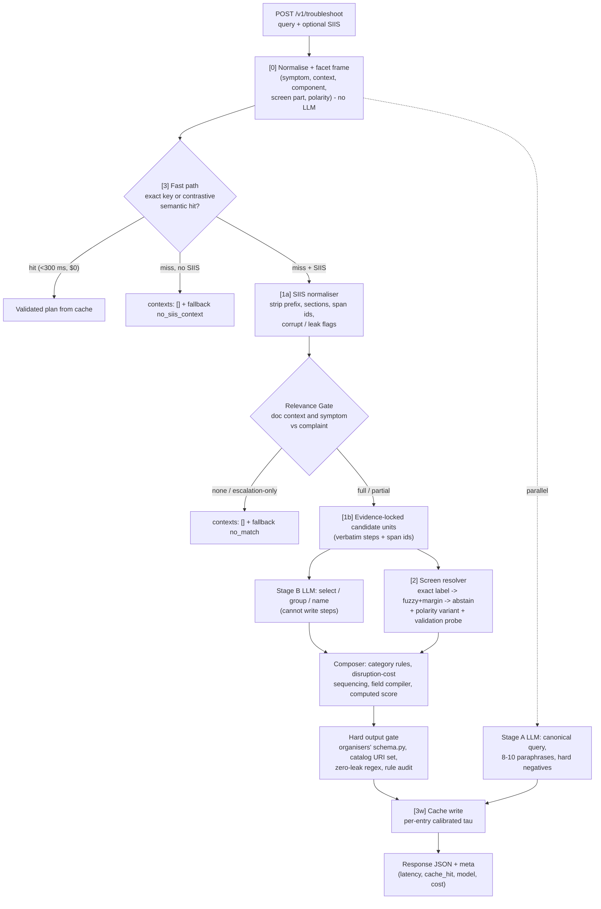

# TapTrace - Smart Guided Troubleshooting Engine

**Samsung PRISM GenAI Hackathon 3.0 · Theme 02 · Team TapTrace (Thapar Institute of Engineering and Technology) · Arnav Joshi**

**Live demo:** https://taptrace.onrender.com/ (API docs at https://taptrace.onrender.com/docs) · **Code:** https://github.com/Arnav020/Tap-Trace · **Demo video:** https://youtu.be/72Otbd-1QvM · **Deck:** [submission/TIET_TapTrace.pdf](submission/TIET_TapTrace.pdf)

> The live demo runs on Render's free plan, which sleeps after 15 minutes idle: the first request can take about a minute to wake it.

TapTrace turns a vague device complaint (plus optional SIIS knowledge text) into a clean, validated, machine-actionable troubleshooting plan:
- every step comes from the knowledge article,
- every Settings step is one tap away through the exact masked catalog deeplink, with a validation probe to confirm it,
- disruptive steps come last.

It answers repeat or paraphrased complaints from a contrastively calibrated semantic cache in milliseconds, with no LLM call.

```
POST /v1/troubleshoot  {"query": "My Nexa X1 touch is laggy", "siis_response": {...}}
-> {"query", "query_variations": [8-10], "response": {"contexts": [Goal...]}, "meta": {"latency_ms","cache_hit","model","cost_usd",...}}
```



### Try it in 60 seconds (live site)

1. Open https://taptrace.onrender.com/ and wait for the **Healthy** pill (the free server may need up to a minute to wake).
2. Pick scenario **#19**, switch **Bypass cache** on and press **Troubleshoot**: the full cold path (both LLM stages, gate, resolver, output gate) answers in a few seconds. Every highlighted sentence on the left is the source of a step on the phone.
3. Press **One tap** on the phone: the exact Settings screen opens through its catalog deeplink and the validation probe confirms the change.
4. Press **Try paraphrase** (served from the semantic cache in milliseconds, $0) and **Try hard negative** (same words, different fix: the cache refuses and says why).
5. Pick scenario **#7** and press **Troubleshoot**: the article is about TV mirroring, so the engine returns an empty plan with `no_match` instead of inventing steps.
6. The API itself is documented at https://taptrace.onrender.com/docs.

## Results (measured by `scripts/evaluate.py`, full report in [metrics.md](metrics.md))

<!-- RESULTS_TABLE -->
| Metric | Target | TapTrace |
| :--- | :--- | :--- |
| Schema-valid responses (organisers' `schema.py`) | >= 99% | **100%** |
| Rule compliance (goal / title / description / names) | >= 95% | **100%** |
| URL leaks | 0 | **0** |
| Deeplink catalog validity | 100% | **100%** |
| Step accuracy vs hand-annotated gold | 0-3 | **3.00** |
| Exact deeplinks, 37-case / 5-domain benchmark | - | **100%** (hybrid 46%, rules 59%, full-LLM 81%) |
| Cache hit rate on unseen cross-model paraphrases (frozen test, N=40) | >= 80% | **80%** (77.5% correct; dev 87%) |
| False hits on hard negatives (frozen test, N=15) | (our metric) | **7%** (global threshold: 7%) |
| Cache-hit latency P95 (exact / paraphrase) | <= 300 ms | **0.4 ms / 3.5 ms** |
| Cold-path latency P95 | <= 8000 ms | **3820 ms** |
| Cold-query cost | tracked | **$0.00031** (cache hit $0) |
<!-- /RESULTS_TABLE -->

Evaluation hygiene:
- Gold annotations carry written rationale.
- Paraphrase sets were written with a different model family than the cache builder.
- The cache numbers above come from a **test set frozen before the last round of changes**. The dev set used for error analysis is reported separately in metrics.md.

## Architecture

Five stages; the LLM may select and name steps but never write one. Module-by-module detail in [docs/ARCHITECTURE.md](docs/ARCHITECTURE.md).



## What makes it different

Full audit in [docs/DESIGN_DECISIONS.md](docs/DESIGN_DECISIONS.md); data findings in [docs/DATA_AUDIT.md](docs/DATA_AUDIT.md).

1. **Evidence-locked extraction.**
   - Steps are derived from exactly one SIIS sentence by deterministic rewrites and keep their span id (`S3.4`).
   - The LLM only selects, groups and names these candidates, so it cannot hallucinate a step or inject a URL.
2. **Compiled Settings ontology.**
   - The 578 noisy catalog rows become 397 screens with `open / on / off / set` variants.
   - 21 TV and appliance distractors plus 2 corrupt rows are quarantined, 6 duplicates collapsed, and misleading `message` fields down-weighted.
   - Resolution goes leaf-only exact label → fuzzy with confidence and margin → abstain (`voiceassist://dummy_positive` or null).
   - The step's polarity picks the variant ("turn off Touch sensitivity" → the offURL entry).
3. **Relevance Gate.**
   - Complaint and article are compared as facets (symptom, problem context).
   - Wrong-document inputs (TV mirroring for a small phone screen, camera-video flicker for a Fold) return `contexts: []` + `fallback: "no_match"`.
   - Partial fits keep only generic remedies.
4. **Contrastive semantic cache.**
   - Each entry gets its own threshold calibrated from its paraphrase and hard-negative clouds.
   - A symbolic guard (polarity, screen part, component, context) and an SIIS fingerprint check protect every hit.
   - We report the **false-hit rate**, not just the hit rate.
5. **Closed-loop verification.**
   - Every catalog-backed step group carries the catalog's verbatim `validationDeeplink`.
   - The demo runs action → probe → ✓ on a simulated device.
6. **Conditional polarity.** Touch sensitivity ON *with* a screen protector and OFF *without* becomes one action (one screen) with two step groups, each with its own deeplink and probe.
7. **10k-scenario reuse.** Step-path → screen memo and a persistent SQLite cache with stored vectors.

## Robustness beyond the provided data

The 20 provided scenarios are all Display complaints, so we also tested the engine on data it was never tuned on:
Battery, Camera, Performance and Wi-Fi articles written in the organisers' SIIS format, a prompt-injection article full of
URLs, and a wrong-document pairing.

- **Held:** every Settings step resolved to the exact catalog screen with the right on/off variant (8/8), every output
  passed the organisers' schema and field rules, injected URLs and instructions were scrubbed, and identical cold requests
  returned byte-identical plans.
- **Fixed:** the audit found plan-assembly defects (a factory reset inside a "back up and reset" sentence was not marked
  critical, article preambles became actions, a same-screen follow-up became a second action, multi-action sentences were
  not atomic, an LLM action name could contradict its deeplink). Each is fixed in code and locked by a regression test
  (`tests/test_engine.py`, 27 tests). Details: [docs/DESIGN_DECISIONS.md](docs/DESIGN_DECISIONS.md) (D11).
- **Known limitations** (documented, not hidden): a few near-miss complaints still hit a cached plan because the facet
  guard has no facet for the difference (for example "camera lens cracked" vs "screen cracked"), and a wrong document keeps
  its generic remedies as a partial fit. See [metrics.md](metrics.md), section 6.

## Quick start

### Docker (recommended)

```bash
cp .env.example .env        # optional: add GROQ_API_KEY (free at console.groq.com) for the LLM cold path
docker compose up --build   # http://localhost:8000  (demo UI)  ·  /health  ·  /docs (OpenAPI)
```

Without a key the container still works:
- cached scenarios are served from the pre-warmed cache;
- new ones run the deterministic path (same grounded steps, template wording).

### Local (Python 3.12)

```bash
python -m venv .venv && .venv/Scripts/activate   # Windows (Linux/macOS: source .venv/bin/activate)
pip install -r requirements.txt
python run.py            # checks deps, starts the API + demo on http://localhost:8000 and opens the browser
```

- Run it inside this folder. `run.py` always switches to `./.venv` by itself, and prints the exact fix if the venv or a dependency is missing.
- Options: `--port 8010`, and `--offline` (no LLM calls, no key needed).
- The equivalent raw command, run inside this folder, is `uvicorn taptrace.api:app --port 8000`.
- In VS Code, press F5 and choose **TapTrace: run API + demo** (`.vscode/launch.json`).

`demo/index.html` is only the UI. The engine is the FastAPI server:
- When the server serves the page (`/`), the page calls it on the same origin.
- If you open the page some other way (VS Code Live Server, or as a file), it looks for the API on `localhost:8000`. If the API isn't running, it shows how to start it.

### Deploy

It is one container that listens on `$PORT`. Render is free and deploys from GitHub using `render.yaml`. Hugging Face Spaces and any Docker host also work. Step-by-step instructions are in [docs/DEPLOY.md](docs/DEPLOY.md).

### Try it

```bash
curl -s localhost:8000/health
curl -s -X POST localhost:8000/v1/troubleshoot -H "Content-Type: application/json" -d "{\"query\": \"Touch input on my Nexa X1 is delayed and the screen responds sluggishly\"}"
```

- `?explain=true` adds a `trace` (evidence spans, gate verdict, resolver candidates, cache decision).
- `?no_cache=true` forces the cold path.
- `siis_response` may be a string or `{"title", "content"}` (the format of `siis_responses.json`).

### Reproduce everything

```bash
pip install -r requirements-dev.txt         # runtime + pytest + deck/disclosure tools (no torch)
pytest -q                                  # 27 tests: contract, rules, traps, gate, cache guard, API, determinism, unseen domains, model fallback (no key needed)
python scripts/build_results.py            # pre-warm cache + results.jsonl (uses the LLM if a key is set)
python scripts/evaluate.py                 # -> metrics.md (Appendix C template, all values computed)
python scripts/audit_report.py             # -> docs/DATA_AUDIT.md
python scripts/build_deck.py --template <CollegeName_TeamName_Submission.pptx>   # -> submission/TIET_TapTrace.pptx
python scripts/export_embedder.py          # (optional, needs requirements-export.txt) re-export the INT8 ONNX embedder
```

## API

| Endpoint | Description |
| :--- | :--- |
| `POST /v1/troubleshoot` | complaint → plan. Body `{query, siis_response?}`. Options: `explain`, `no_cache` |
| `GET /health` | `200 {"status":"ok"}` only after catalog, embeddings, cache and LLM client are initialised |
| `GET /v1/metrics` | requests, hit rate, cumulative cost, cache size, resolver memo hits, start-up time |
| `GET /v1/catalog/noise-report` | what the Catalog Compiler found in `deeplinks.json` |
| `GET /` | demo console (agent view with provenance + phone emulator with one-tap execution and validation) |

Fallbacks:
- `no_match`: the knowledge text has no viable solution for this complaint.
- `no_siis_context`: no SIIS text was sent and no cached plan matches.

LLM failures never fail a request; the engine degrades to its deterministic path.

## Output rules enforced in code

| Rule (Theme 2 PDF §4) | Enforcement |
| :--- | :--- |
| Schema | organisers' `data/schema.py`, unchanged (SHA-256 checked in tests), validates every response |
| Goal / title / actionName / description syntax | generators + validators + repair in `taptrace/fields.py`; audited again before output |
| Zero URL leaks | leak-bearing SIIS sentences are never used; regex scrubber + hard gate |
| Catalog integrity | URIs are copied from catalog objects; any URI outside the catalog set is rejected |
| manual ⇒ no deeplink; critical last | rule-based category + disruption-cost sequencing |
| Pure JSON | responses serialised from Python objects (ORJSON), never raw LLM text |

## Repository map

```
taptrace/        engine: catalog, siis (gate + extraction), facets, resolver, llm, llm_stage, plan, fields, cache, engine, api
data/            organisers' files, byte-identical (schema.py, deeplinks.json, siis_responses.json, input.txt, sample_output.json)
artifacts/       INT8 ONNX embedder, pre-warmed cache.sqlite, per-scenario explain traces
eval/            gold annotations, held-out paraphrases, hard negatives, 37-case mapping benchmark
scripts/         build_results, evaluate, stress_test, audit_report, build_deck, deck_postprocess.ps1, make_hero, fill_disclosure, export_embedder
tests/           27 pytest gates (no API key needed)
demo/            single-page console served at /
docs/            ARCHITECTURE, DESIGN_DECISIONS, DATA_AUDIT, DEPLOY, VIDEO_SCRIPT
submission/      TIET_TapTrace.pptx + .pdf (deck), TIET_TapTrace_AI_Disclosure.docx, deck_assets/
results.jsonl    one Appendix-B line per provided input
metrics.md       Appendix-C report
run.py           one-command local launcher (uses ./.venv)
Dockerfile, docker-compose.yml, render.yaml   container + one-click Render deployment
requirements.txt (runtime) · requirements-dev.txt (tests, deck) · requirements-export.txt (optional model re-export)
```

## Notes on the provided data

- The deeplink scheme follows the data (`voiceassist://`), not the PDF example (`bixby://`). Naming follows the data (TechCorp / Nexa).
- `input.txt` line *i* pairs with the *i*-th record of `siis_responses.json` (ids skip `row_6` and `row_18`).
- `sample_output.json` is treated as illustrative: its 9–11-word descriptions break PDF §4.1, so the PDF rules win.

## Model & cost

- The cold path uses Groq `openai/gpt-oss-120b` (free tier; list price $0.15 / $0.60 per 1M tokens, used for cost accounting).
- If the primary is rate-limited (for example, the free tier's daily token cap), the same call goes automatically to `openai/gpt-oss-20b` ($0.075 / $0.30 per 1M). The primary is skipped until its Retry-After passes. Only if both fail does the engine use its deterministic path. Each response's `meta.model` names the model that actually answered, and `metrics.md` reports the mix for its run.
- Any OpenAI-compatible provider works through `.env` (`GEMINI_API_KEY`, `OPENAI_API_KEY`, `OPENROUTER_API_KEY`).
- Embeddings: `all-MiniLM-L6-v2` in INT8 ONNX (23 MB, CPU).
- Cache hits cost $0.

## AI usage

Built with Claude Code (Anthropic) under the team member's direction. See `submission/TIET_TapTrace_AI_Disclosure.docx`.
