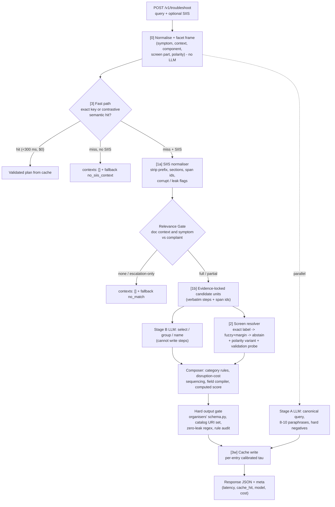

# TapTrace Architecture

## Pipeline

## Modules

| Module | Responsibility | Key idea |
| :--- | :--- | :--- |
| `taptrace/catalog.py` | Catalog Compiler | 578 noisy rows -> 397 screens x {open,on,off,set}; quarantines 21 TV/IoT distractors + 2 corrupt rows; collapses 6 duplicates; noise report |
| `taptrace/siis.py` | SIIS normaliser, Relevance Gate, candidate units | steps are derived from exactly one source sentence by meaning-preserving rewrites; span ids kept for provenance |
| `taptrace/facets.py` | Facet frames | symbolic view of a complaint: symptoms, problem contexts, components, screen part, on/off polarity |
| `taptrace/resolver.py` | Deeplink resolution | leaf-only exact label -> fuzzy with confidence+margin (never for critical) -> abstain to `dummy_positive`/null; step-path memo for 10k-scenario reuse |
| `taptrace/llm.py` | LLM adapter | any OpenAI-compatible endpoint; JSON mode; temperature 0 + seed; token cost accounting; bounded Retry-After |
| `taptrace/llm_stage.py` | Stage A / Stage B prompts + validation | LLM may only select/group/name grounded candidates; deterministic fallbacks |
| `taptrace/plan.py` | Composer | verbatim catalog deeplinks + validation probes, rule-based category, disruption-cost ordering, computed score, organisers' schema validation |
| `taptrace/fields.py` | Field compiler + validators | every PDF 4.1 rule as code; zero-leak scrubber |
| `taptrace/cache.py` | Contrastive semantic cache | per-entry tau from positive/negative clouds, facet guard, SIIS fingerprint check, SQLite persistence |
| `taptrace/engine.py` | Orchestrator | budgets, parallel LLM stages, fallbacks, hard output gate |
| `taptrace/api.py` | REST API | `/v1/troubleshoot`, `/health`, `/v1/metrics`, `/v1/catalog/noise-report`, demo |

## Guarantees enforced in code (not in prompts)

| PDF rule | Where |
| :--- | :--- |
| Schema conformance | `plan.to_contract` validates with the organisers' unchanged `data/schema.py` (hash-checked in tests) |
| Zero URL leaks | `siis.LEAK_SENTENCE` drops leak-bearing source sentences; `fields.LEAK_RX` scrubs + `engine._hard_gate` rejects |
| Catalog integrity | deeplinks are copied from catalog row objects; `_hard_gate` rejects any URI not in the catalog set |
| No hallucinated steps | steps come only from SIIS sentences; the LLM cannot author step text; gate -> `no_match` |
| Pure JSON | ORJSON responses from Python objects; LLM text never passes through raw |
| goal / title / description / actionName syntax | `fields.py` generators + validators + repair; audited again by `validate_goal_obj` |
| manual => no deeplink; critical last | `plan.build_action`, `plan._cost`, `_hard_gate` |
| Deterministic execution | temperature 0 + seed, deterministic fallbacks, exact-key cache, stable sort |
| Parent-menu avoidance | `resolver._exact` looks only at the leaf (and its screen), never at top-level menus |

## Latency budget (cold path)

Stage A (enrichment) starts at t=0 in a worker thread. The gate, units and resolution take roughly 20-60 ms on CPU.
Stage B then runs, and the two LLM calls overlap. Each has a hard timeout under the 7 s budget, and a timeout degrades to the deterministic path, so the service never fails a request because of the LLM.
